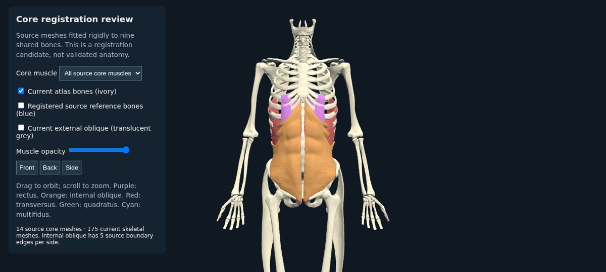
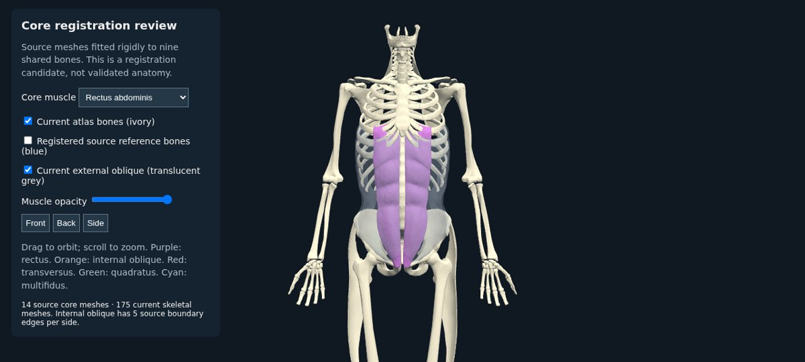
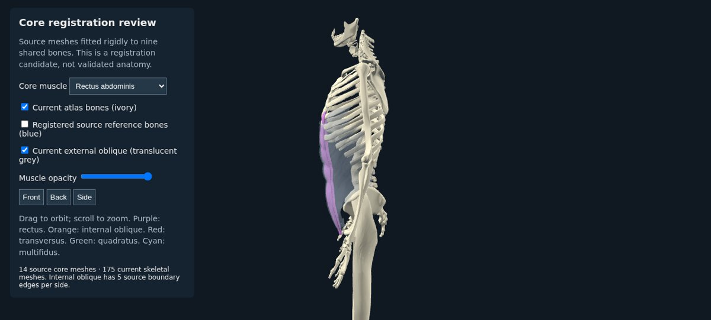
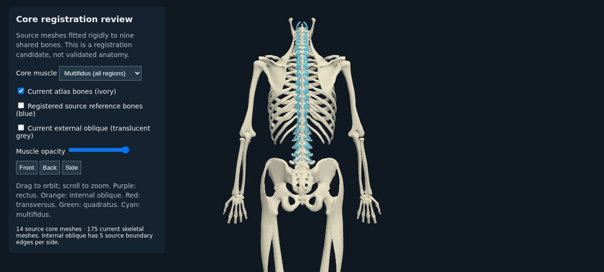

# Core muscle source review — SWR-512

The missing separately identified core targets have been found as actual mesh objects in Z-Anatomy. This research supplement contains 14 bilateral muscle meshes and 17 skeletal reference meshes. It is not installed into the male or female atlas: registration, existing abdominal-wall boundaries and female attachment review remain unresolved.

## Provenance and scope

Source: [Z-Anatomy Models-of-human-anatomy](https://github.com/Z-Anatomy/Models-of-human-anatomy/tree/0752b0e5c71f8a553115d797a5d321f7a77f8d82), pinned commit `0752b0e5c71f8a553115d797a5d321f7a77f8d82` (2026-09-05). The downloaded `Z-Anatomy.zip` contains `Z-Anatomy/Startup.blend`, extracted locally as `source.blend`.

| File | SHA-256 |
|---|---|
| Z-Anatomy.zip | `e029688545627bd0214b269e1063143abb580aad72b2c2445d6d8a9a0d9da736` |
| source.blend | `9f08a17ea0115fed80b2a73ecdf0a1bc2ab2f6956f37c593ce23d513ea35afcd` |
| License.txt | `196b66b56551a862e59872f7cdb70e6d9a6ad84e9105962fca8ec28c14e97520` |

The [pinned license](https://github.com/Z-Anatomy/Models-of-human-anatomy/blob/0752b0e5c71f8a553115d797a5d321f7a77f8d82/License.txt) specifies CC BY-SA 4.0 for Z-Anatomy and also lists component exceptions for inner ear and kidney. This export uses an explicit allowlist of core muscles and skeletal references; it includes neither ears nor kidneys, definitions, textures, or embedded scripts. The original license is copied to `data/anatomy/z-anatomy/LICENSE.source.txt`. Attribution for this derived geometry: **Z-Anatomy — The libre 3D atlas of anatomy — CC BY-SA 4.0; BodyParts3D — The Database Center for Life Science**. Source authors include Kousaku Okubo, Gauthier Kervyn and Marcin Zielinski. These exported geometries remain CC BY-SA 4.0. This does not change the app source-code license.

The source is a male anatomical model, not a measured female dataset. It can supply missing named structures; it cannot independently validate female fitting.

## Confirmed object inventory

| Target | Source objects | Total source triangles |
|---|---|---:|
| Rectus abdominis | `Rectus abdominis muscle.l/.r` | 41,208 |
| Internal oblique | `Internal abdominal oblique muscle.l/.r` | 57,738 |
| Transversus abdominis | `Transversus abdominis muscle.l/.r` | 68,656 |
| Quadratus lumborum | `Quadratus lumborum muscle.l/.r` | 5,664 |
| Multifidus | `Multifidus colli/thoracis/lumborum muscle.l/.r` | 16,224 |

The 14 objects have no active modifiers. Export applies their object matrices, corrects reflected winding, and preserves the source mesh geometry in meters/Z-up. It does not substitute labels, infer boundaries or copy unrelated models. The binary layout is documented by `core-source.json`: positions and normals are float32, indices uint32, offsets in bytes. `core-source.bin` is 7,074,504 bytes including registration bones.

The source has five boundary edges in each internal oblique: perimeter approximately 3.69 mm, bounding box approximately 0.52 × 1.05 × 1.09 mm. They remain unmodified and must be reviewed before sealing. The other 12 target meshes have no boundary edges; all 14 have no nonmanifold edges or degenerate triangles under the reported checks. A small number of face normals disagree with interpolated vertex normals; this is retained in the report and does not alone establish reversed topology.

## Registration and overlap review

`register-z-anatomy-core.py` calculates one rigid transform from five lumbar vertebrae and bilateral ribs 11/12. It keeps meter scale, uses separate corresponding bones during trimmed nearest-vertex ICP, and holds out bilateral first ribs, hips, femurs and scapulae. It does **not** fit the body by bounding-box proportions or claim the sampled vertices are anatomical landmarks.

Symmetric sampled nearest-vertex RMS residuals are approximately **2.9–7.0 mm on fitted bones** and **9.3–12.6 mm on held-out bones**. These are sampling-dependent distances, not point-to-surface errors or proof of valid muscle attachment. Source bones have been edited and are not identical to the current BodyParts3D atlas. The exported transform is a review candidate only.

The overlay permits independent muscle isolation, front/back/side views, source-versus-current bone comparison and a translucent retained external-oblique layer. Initial visual review shows plausible broad rectus and paraspinal placement, but does not resolve attachment positions or layer intersections. The current external-oblique pair spans the anterior abdominal wall; it must be checked for merged tissue or aponeurosis before adding new structures. Missing names do not prove missing physical tissue.

A volume-containment check explicitly refuses to report percentages because current FJ1452/FJ1452M have 3/7 nonmanifold edges after exact seam welding. Ray-parity assumptions therefore fail. `overlap-review.json` records this prerequisite failure rather than a misleading no-overlap result.






## Reproduce

On Ubuntu 24.04, `bash scripts/setup-blender-review.sh` downloads Ubuntu Blender 4.0.2 and its runtime dependencies into `/tmp/human-atlas-blender`, without installing system packages. The explicit package list is in the script. Package download versions can change with Ubuntu updates; `core-source.json` pins the anatomy source and exported binary instead.

Download the pinned [archive](https://raw.githubusercontent.com/Z-Anatomy/Models-of-human-anatomy/0752b0e5c71f8a553115d797a5d321f7a77f8d82/Z-Anatomy.zip), verify the hashes above, and extract only `Startup.blend` to `/tmp/human-atlas-source-review/source.blend`. Do not install the template or execute its embedded code. Export with:

```bash
LD_LIBRARY_PATH=/tmp/human-atlas-blender/root/usr/lib/x86_64-linux-gnu:/tmp/human-atlas-blender/root/usr/lib \
BLENDER_SYSTEM_SCRIPTS=/tmp/human-atlas-blender/root/usr/share/blender/scripts \
BLENDER_SYSTEM_DATAFILES=/tmp/human-atlas-blender/root/usr/share/blender/datafiles \
/tmp/human-atlas-blender/root/usr/bin/blender -b --factory-startup --disable-autoexec \
  /tmp/human-atlas-source-review/source.blend \
  --python scripts/extract-z-anatomy-core.py -- --out data/anatomy/z-anatomy
python3 scripts/validate-z-anatomy-core.py
python3 scripts/register-z-anatomy-core.py
python3 scripts/review-core-overlap.py
python3 scripts/z-anatomy-core.test.py
```

Blender reports a pre-existing oesophagus dependency cycle outside the allowlist, and confirms that embedded `z-anatomy.py` was skipped. No selected muscle modifiers depend on that cycle.

To view the interactive artifact, `python3 scripts/stage-core-review.py` copies only required public geometry and Three.js files to `/tmp/human-atlas-core-review-public`. Serve that isolated directory:

```bash
python3 -m http.server 3018 --bind 127.0.0.1 --directory /tmp/human-atlas-core-review-public
```

Open `http://localhost:3018/docs/core-registration-review.html`. Production atlases and application routes are unaffected. Screenshots above provide an offline record.

## Remaining acceptance

1. Review existing external-oblique anatomy and candidate core boundaries; decide whether shared wall geometry needs replacement or subdivision rather than an additive overlay.
2. Register attachment regions against the final shared framework, including the female pelvis; inspect origin/insertion and layer relationships.
3. Review the approximately 1 mm internal-oblique source holes and any justified repair as a separately recorded derivative.
4. Integrate independently selectable, searchable concepts into male and female builds with accurate provenance, then verify the actual user-facing model.

SWR-512 stays **In Progress**. Source discovery and extraction are completed; restoration in the teaching atlas is not.
