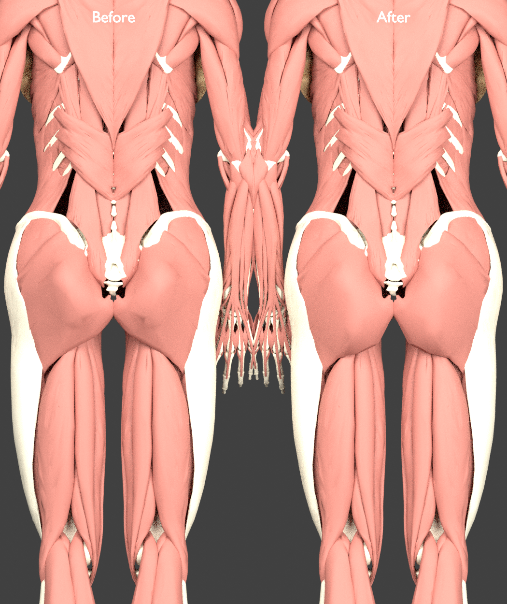
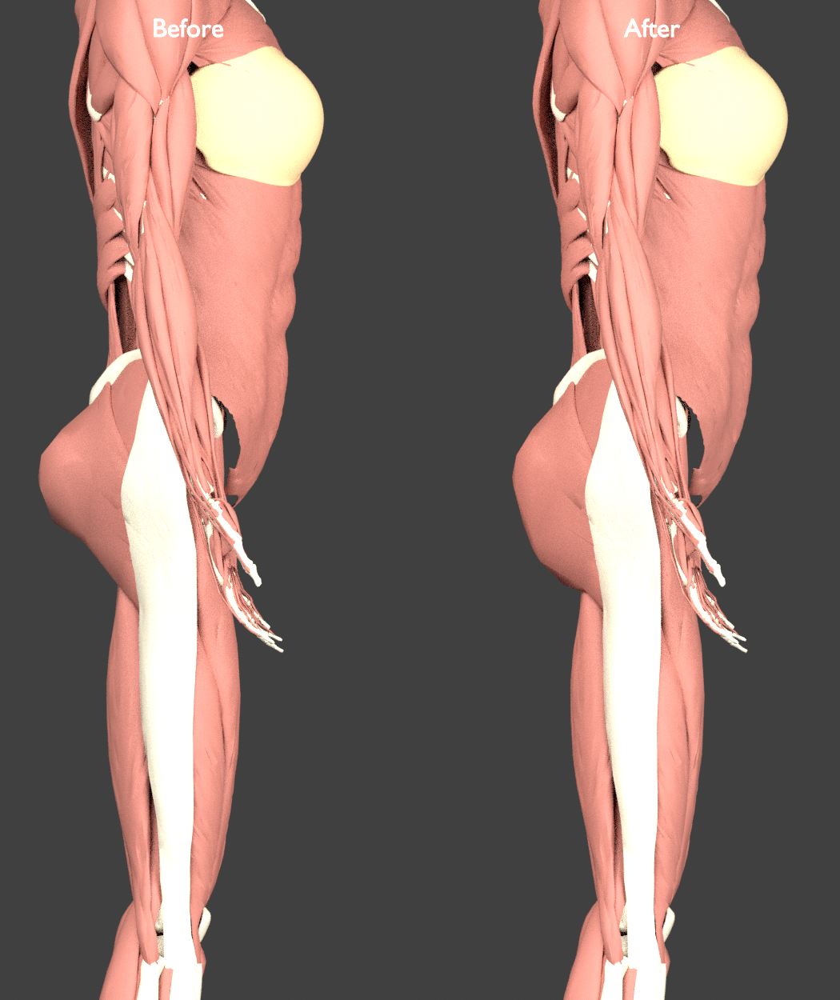
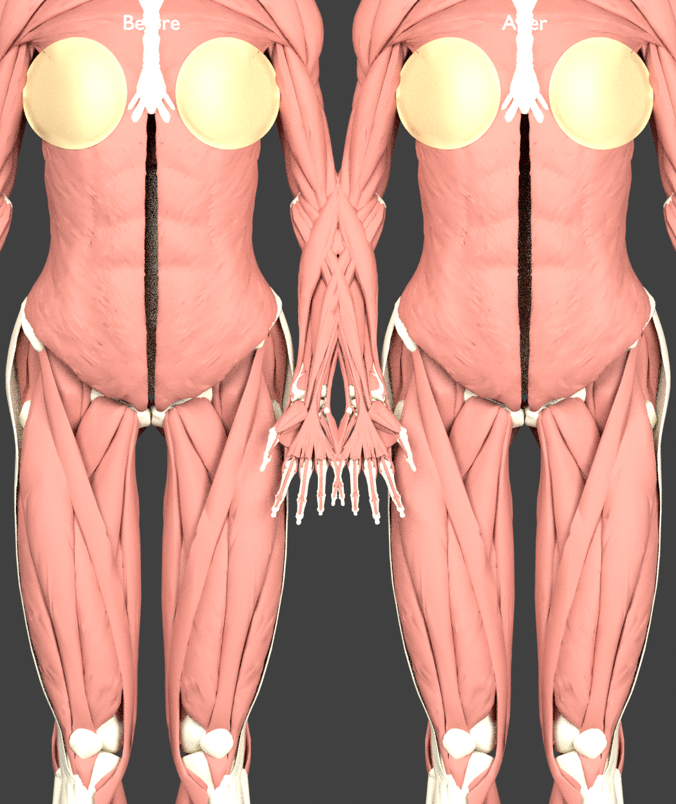

# Female glute contour correction

This glute contour remains in use. The subsequent [waist refinement](female-waist-slimmer-review.md) changes torso width and the full-model manifest; glute positions and normals remain identical to this reviewed stage.

Published after matched rear and side close-up review and independent geometry checks. Final manifest SHA-256: `e753425a2c6bffcde9e2dc6478e37f96c2e4bec20f2f5ce1a1a0bdef0233eabf`.

The supplied [front, back and side reference](https://as2.ftcdn.net/v2/jpg/00/77/91/69/1000_F_77916955_HK9TuhgkxYxzm4SC3uvUbdCKZyRZ83FG.jpg) shows a broad glute body, a rounded inferior outline, and a continuous side profile. The earlier depth-only pass concentrated displacement into a small posterior region and retained the source mesh’s diagonal lower outline. Increasing posterior depth alone could not change that rear silhouette.

This correction reduces and spreads the added depth and adjusts the lower posterior contour. The model remains an illustration-guided adaptation of the male source muscles, not a sourced female muscle segmentation or a validated movement model. Exposed iliac and sacral areas and existing pelvic registration problems require separate work.

## Candidate iteration

The first combined depth/inferior candidate improved the rear outline but produced a shelf-like lower side edge. It was not published. A second candidate added a smooth lower height ramp to the depth support. Its side silhouette was still too blunt because the inferior component lowered the far posterior surface along with the lower edge. A third candidate fades the inferior component out at that far posterior surface, retaining the adjustment in an intermediate depth band. The first two candidates were not published.

## Review evidence

The preceding [hip/shoulder balance pass](female-glute-review.md) and its evidence are retained for comparison. These matched renders show the previous depth-only model on the left and the accepted contour on the right. They use actual muscle, bone and breast-envelope geometry under identical orthographic cameras and lighting; application materials and other organ systems are omitted.







The accepted contour has a less triangular lower rear outline and a gentler side return toward the thigh. It does not reproduce every detail of the reference illustration. The source mesh’s lateral insertion tip and exposed pelvic regions remain visible.

## Measured scope and change

The [independent report](../data/anatomy/female-glute-contour-review.json) compares the previous published model with this version and records all input hashes. Only right/left gluteus maximus (`FJ1418`, `FJ1418M`) and inferior gluteal veins (`FJ3513`, `FJ3606`) receive the local contour. All 2,239 other meshes retain bit-identical stored positions and normals. Every mesh retains its topology and lateral coordinates, so the existing hip/shoulder widths and waist remain unchanged in this correction.

The change reaches 161/1,328 right and 166/1,336 left glute vertices (about 12%), compared with the previous narrow depth adjustment’s approximately 2% coverage. The maximum localized inferior shift is 16.77 mm; overall glute height bounds stay unchanged. Relative to the previous version, the old posterior prominence is reduced by up to 10.61 mm, while other points gain up to 13.80 mm posterior depth. These are different points, not a uniform translation or enlargement. Counts are not surface-area-weighted.

The source depth amplitude falls from 30 to 20 mm, the center moves from source y=.905 to .880 m, and its vertical radius expands from .145 to .180 m. Lower depth support rises smoothly over y=.780–.860 and fades over .830–.895 m. The inferior component fades away near the midline, lateral insertion, anterior tissues, and far posterior surface; the full parameters are recorded in the fit report. Normals use the same field’s inverse-transpose Jacobian.

## Validation and limitations

- All 2,243 meshes, 4,246 concept mappings, 2,437,922 triangles and binary buffers pass source validation.
- Eleven morph tests and three integration tests pass, including JavaScript/Python agreement, explicit per-part scope and normals across the new depth/height transitions.
- Both sampled deformation fields have a positive minimum Jacobian of 0.377125. Finite sampling does not prove positivity everywhere.
- Fixed original source vertices within 3 mm of their source pelvic/femur bone triangles have less than 0.000060 mm added displacement. At 5 mm, the maximum is 0.238 mm; maximum measured bone-distance increases are 0.133 mm right and 0.201 mm left. These are engineering proximity screens, not annotated attachments or physiological tolerances.

Existing cross-source pelvic gaps remain unresolved. The checks do not certify muscle volume, attachment placement, movement mechanics or freedom from intersections. The current [pelvis audit](pelvis-surface-audit.md) records the separate registration screen. Both rejected candidate reports are preserved as [first candidate](../data/anatomy/female-glute-contour-first-candidate.json) and [taper candidate](../data/anatomy/female-glute-contour-taper-candidate.json).

## Reproduce

```bash
python3 scripts/build-female-reconstruction.py --output-dir /tmp/human-atlas-glute-rounded-final-candidate/public/models
python3 scripts/female-proportion-morph.test.py
python3 scripts/female-morph-integration.test.py
python3 scripts/female-glute-contour-review.py --before-root /tmp/human-atlas-glute-scoped-candidate --after-root /tmp/human-atlas-glute-rounded-final-candidate
```

The before root must contain the saved previous depth-only atlas. Candidate source validation requires the original male/HRA manifests and their referenced buffers in the candidate facade. Attribution remains in [ATTRIBUTION.md](../public/ATTRIBUTION.md).
