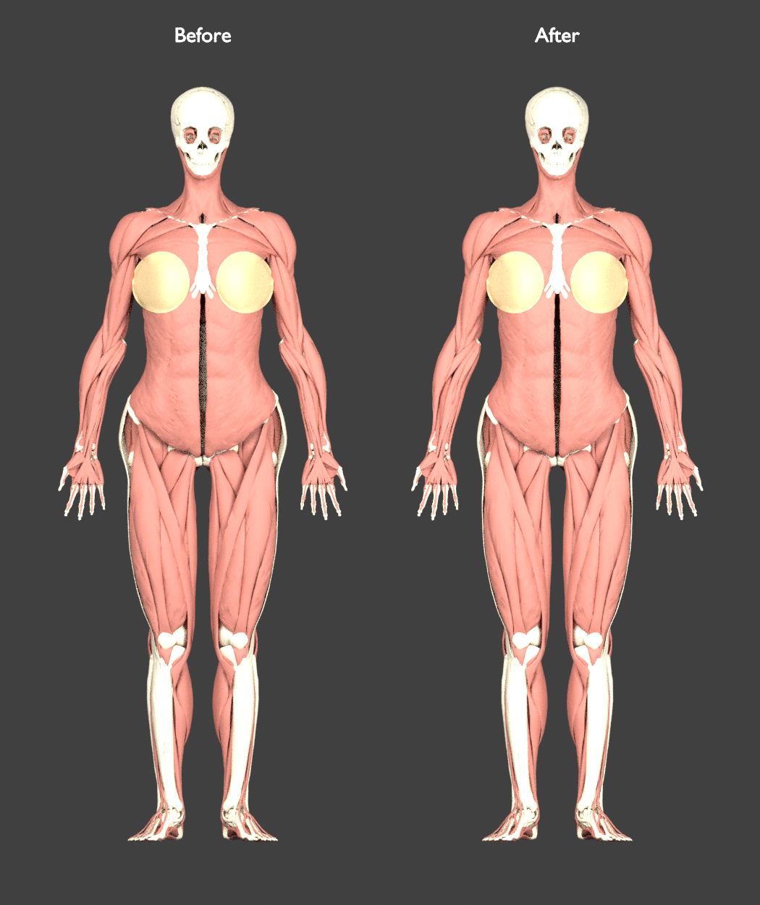
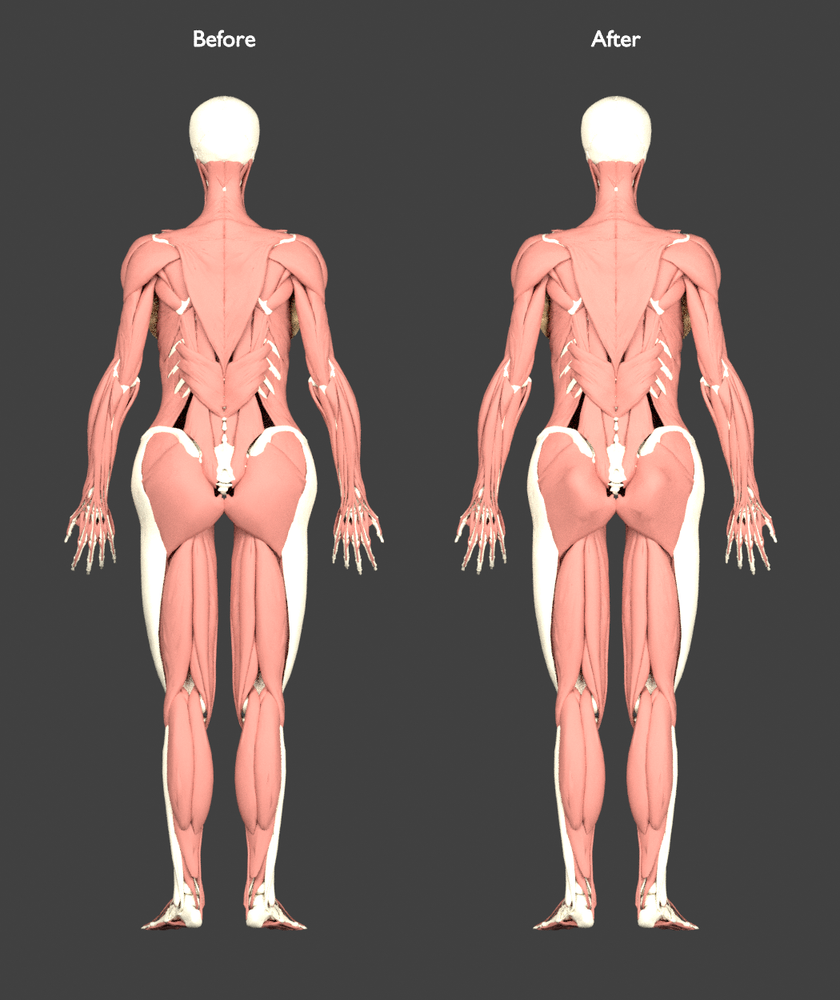
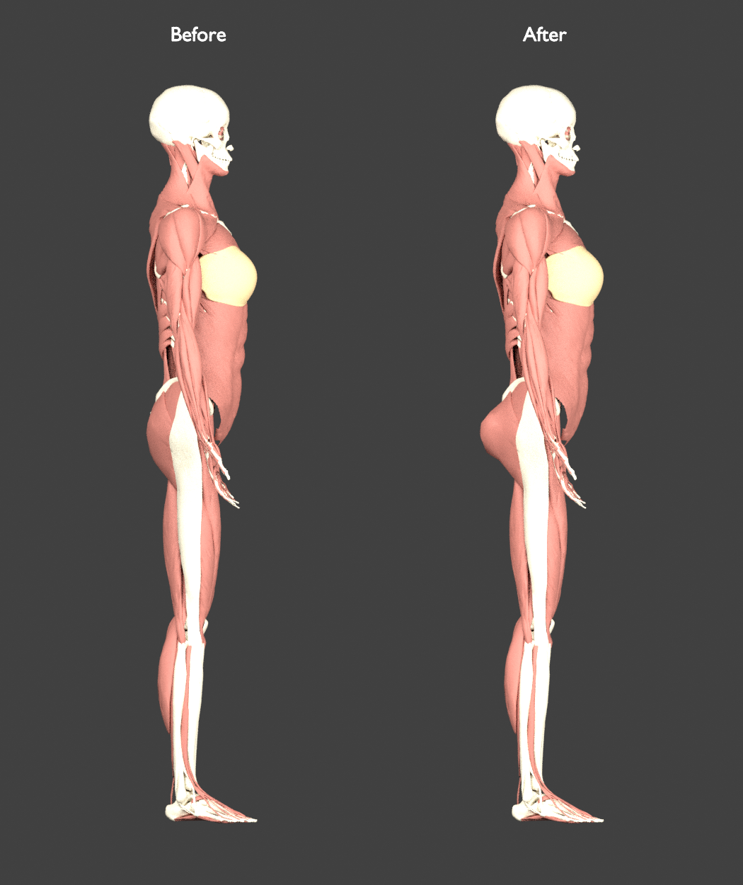

# Female hip, shoulder, and posterior glute balance

**Historical stage, superseded by the [glute contour correction](female-glute-contour-review.md).** The measurements, renders and unchanged-y claims below describe the earlier depth-only geometry. The current contour also makes a localized vertical adjustment.

This pass addresses the user’s front, back, and side reference: the previous wider hips needed less lateral flare and a clearer posterior glute contour. It is an illustration-guided study shape, not a population standard or anatomically certified reconstruction. The final candidate was reviewed in front, back, and side views, independently checked, and was published at that stage.

The supplied [three-view female anatomy illustration](https://as2.ftcdn.net/v2/jpg/00/77/91/69/1000_F_77916955_HK9TuhgkxYxzm4SC3uvUbdCKZyRZ83FG.jpg) guides the front shoulder/hip balance, paired rear glute contour, and posterior side projection together. Earlier [Sketchfab](https://sketchfab.com/3d-models/ecorche-female-musclenames-anatomy-cda17af4be354c8b8375ff0b1b8a5fe5) and [male/female comparison](https://as2.ftcdn.net/v2/jpg/00/43/97/89/1000_F_43978903_YzhmBhtc7BjKEc4wph42Gx3zpGTzdJn2.jpg) references still inform the slim waist. These images are not calibrated donor measurements.

## Measured change from the slimmer-waist version

| Mesh envelope | Before | Updated | Change |
| --- | ---: | ---: | ---: |
| Gluteal width | 334.7 mm | 318.7 mm | −4.77% |
| Ilium width | 324.3 mm | 308.7 mm | −4.82% |
| Deltoid width | 401.8 mm | 407.5 mm | +1.42% |
| External-oblique waist band | 245.9 mm | 245.9 mm | Unchanged |

The gluteal-to-deltoid envelope ratio changes from **0.833 to 0.782**. Both gluteus maximus surfaces gain up to **28.497 mm of posterior projection**. Widths are actual mesh extents; they are not annotated anatomical landmark distances. All vertical coordinates remain exactly unchanged. The measured waist keeps its previous reduction of 4.5% relative to the original pre-proportion model.

The [geometry report](../data/anatomy/female-glute-review.json) also measures anterior/posterior ray gaps at matching x/y locations on actual pelvic-bone triangles. It records source vertex indices and excludes rays that miss the bones in either stage. Those measurements avoid subtracting unrelated global extrema. They are not muscle thickness: some rays encounter anterior pubis when no posterior bone is present, and the surfaces are not annotated attachments.

## Front, back, and side review

These renders compare the preceding slim-waist model with the final scoped geometry under matched orthographic cameras and lighting. They display actual muscle, skeletal, and outer breast-envelope meshes; application tissue materials and other systems are omitted.







## Universal width field, explicitly scoped posterior contour

The lateral hip plateau changes from 1.22 to 1.15, the shoulder plateau from 0.85 to 0.88, and the outer-arm translation from −6 to −3 mm before stature scaling (−2.85 mm afterward). The slim-waist knot stays 0.955. The lateral field still blends smoothly between torso and limb coordinates and applies to every mesh.

The posterior component is different. It uses paired smooth lobes centered at source |x| = 0.070 m, y = 0.905 m, with radii 0.100/0.145 m and amplitude 0.030 m. It fades away at the rim and midline and only activates behind source z = −0.100 m. The fit report explicitly limits this component to:

| Source ID | Structure | Maximum added posterior displacement |
| --- | --- | ---: |
| FJ1418 | Right gluteus maximus | 28.497 mm |
| FJ1418M | Left gluteus maximus | 28.497 mm |
| FJ3513 | Left inferior gluteal vein | 18.761 mm |
| FJ3606 | Right inferior gluteal vein | 0.526 mm |

The asymmetric vein displacements follow the existing source positions; they are not independently chosen left/right offsets. All other IDs—including unknown IDs, bones, pelvic organs, uterine ligaments, and lumbar muscles—receive no new posterior component. Every skeletal depth coordinate is exactly unchanged, although the universal lateral rebalance does move skeletal vertices sideways. The report lists all 211 affected skeletal meshes; their maximum lateral displacement is 8.375 mm. This is not a claim that joint positions remain unchanged.

The first universal-depth experiment also displaced already-misregistered uterine ligaments in the posterior region. It was rejected. Its [recorded evidence](../data/anatomy/female-glute-shared-rejected.json) remains available; the explicit allowlist prevents that unwanted change without claiming the initial ligament registration is correct. The [scope comparison](../data/anatomy/female-glute-scope-comparison.json) proves the four intended glute/vein meshes retain the reviewed candidate positions while excluded structures recover their original depth.

## Verification and limits

- Source validation checks all 2,243 meshes, 4,246 concepts, 2,437,922 triangles, source topology, transforms, buffers, and unit normals.
- Actual before/after comparisons verify unchanged topology and every vertical coordinate, all skeletal/organ depth coordinates, source registration transforms, and the existing −3 mm internal breast insets.
- Three additional integration tests compare the actual JavaScript validator with the Python builder across 1,280 eligible/excluded cases, check transformed normals against surface tangents, and verify per-ID control propagation in a combined atlas mesh.
- Eight independent morph tests cover builder/audit agreement, explicit ID eligibility, excluded bone/organ/lumbar IDs at the same active position, symmetry, outer-arm translation, legacy inputs, and finite positive Jacobians across lateral and posterior gate boundaries.
- Both the base field and optional posterior field are sampled for Jacobian positivity; the minimum is **0.37713**. Normals use the corresponding field’s inverse-transpose Jacobian.

These checks do not validate muscle volume, attachment locations, physiological movement, or absence of all intersections. The posterior component is scoped by mesh ID, so the previous statement that all shape changes share one universal field no longer applies. Existing cross-source pelvis/organ registration remains a separate unresolved issue.

## Current pelvis limits

The current [pelvis audit](pelvis-surface-audit.md) and registration experiment match the published manifest and all audited chunks. Relative to the original pre-proportion baseline, the same 36 proximity patches retain p95 gap increases of **0.0001–0.3262 mm**; narrowing the previous hip flare reduces the former maximum increase of 0.759 mm. The underlying gaps remain substantial: femur patches are 9.27/8.94 mm, gluteus maximus patches about 25.10/25.15 mm, and L5-disc patch 12.89 mm. These are unsigned geometric screens, not validated anatomical attachment distances.

## Reproduce

```bash
python3 scripts/build-female-reconstruction.py \
  --output-dir /tmp/human-atlas-glute-scoped-candidate/public/models
python3 scripts/female-proportion-morph.test.py
python3 scripts/female-morph-integration.test.py
python3 scripts/female-glute-review.py \
  --before-root /tmp/human-atlas-waist-candidate \
  --after-root /tmp/human-atlas-glute-scoped-candidate
```

Keep the earlier waist atlas as the before root. Source validation also needs the original male/HRA manifests and their referenced chunks in the candidate facade. The older [hip/waist proportion review](female-proportion-review.md) and its hash-linked reports/images are preserved as historical stages, superseded by this pass. Attribution remains in [ATTRIBUTION.md](../public/ATTRIBUTION.md).
