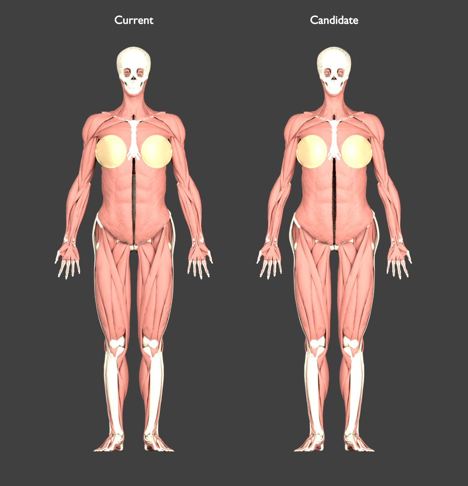
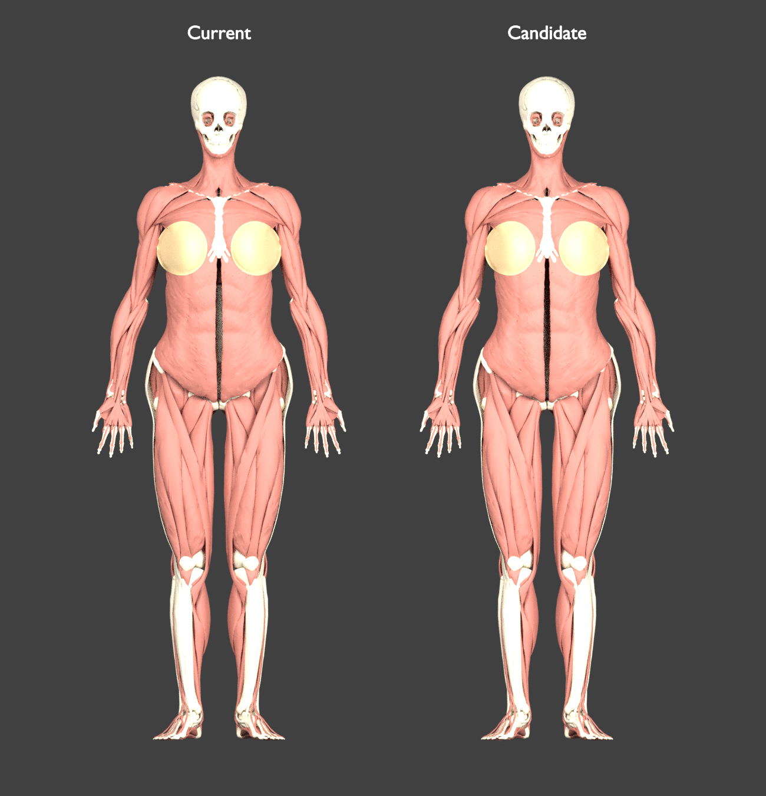

# Female hip, shoulder, and waist silhouette adjustment

**Historical stage, superseded by the [three-view glute/hip balance pass](female-glute-review.md).** The tables, images, hashes, and lateral-only verification below describe the earlier model. Its 9% hip widening and universal no-depth-change claim do not describe the latest geometry.

[SWR-517](https://linear.app/stealth-company/issue/SWR-517): the user's requested wider pelvis/hips, narrower shoulder silhouette, and slimmer waist are now applied after separate candidate validation and visual review. This is an **artistic reference-build adjustment**, not a claim that all female bodies have these proportions or a population-calibrated anatomical model.

The supplied [movement illustration](https://as2.ftcdn.net/v2/jpg/15/60/68/51/1000_F_1560685187_zEMPM1N0EJRxhuaZdNMZYvFaaz7TCT7n.jpg) and [front/back anatomy illustration](https://as2.ftcdn.net/v2/jpg/14/70/93/01/1000_F_1470930188_f4Jov2p3B4BavIshxjOOmDtyqsGCGvyQ.jpg) were inspected visually. They guide the relationship of shoulder, waist, and hip contours; their posed/perspective silhouettes are not treated as calibrated measurements.

The follow-up waist pass also uses the supplied [Sketchfab female écorché](https://sketchfab.com/3d-models/ecorche-female-musclenames-anatomy-cda17af4be354c8b8375ff0b1b8a5fe5), including its interactive three-quarter view, and [male/female anatomy comparison](https://as2.ftcdn.net/v2/jpg/00/43/97/89/1000_F_43978903_YzhmBhtc7BjKEc4wph42Gx3zpGTzdJn2.jpg). The concave lateral waist and smooth transition into the pelvis guided a modest waist reduction. The Sketchfab model exposes the pectorals; its breast layer is not a target for the application’s separate adipose/gland presentation. None of these views supplies a calibrated depth measurement, so this pass adds no gluteal projection.

## Actual mesh measurements

| Geometric envelope | Original | Final published | Net change |
| --- | ---: | ---: | ---: |
| Both ilia | 297.5 mm | 324.3 mm | +9.0% |
| Gluteal muscles | 307.3 mm | 334.7 mm | +8.9% |
| Deltoid muscles | 413.2 mm | 401.8 mm | −2.8% |
| Both scapulae | 294.4 mm | 279.8 mm | −5.0% |
| Selected upper-thigh muscles | 310.8 mm | 317.4 mm | +2.1% |
| External-oblique waist band | 257.4 mm | 245.9 mm | −4.5% |

The gluteal-to-deltoid envelope ratio changes from **0.744 to 0.833**. These widths are measured from the actual vertices of the identified meshes. They are not biacromial, bi-iliac, or other manually annotated anatomical landmark distances. Exact mesh IDs and height bands are recorded in [female-proportion-review.json](../data/anatomy/female-proportion-review.json).

The first pass widened the hip envelopes and narrowed the shoulders. Its [measured report](../data/anatomy/female-proportion-first-pass.json) and image are preserved:



The comparison shows actual meshes with identical camera and lighting. Only muscle, skeletal, and outer breast-envelope geometry is rendered; the image does not reproduce the application's tissue materials or other visible systems. The wider upper hips and slightly narrower shoulders give the intended change in overall balance. This image is not an anatomical certification.

The final waist pass reduces the same external-oblique waist band from **259.7 to 245.9 mm (−5.3% relative to the first pass)**, or −4.5% from the original model. The measured shoulder, ilium, gluteal, scapula, and upper-thigh widths are exactly unchanged in this second pass. See the [separate waist measurements](../data/anatomy/female-waist-review.json); the main report composes the two hash-linked measurement passes to describe the published result.



## What the shared field changes

The pelvis-height lateral plateau increases from 1.10 to 1.22, then blends smoothly toward the waist. The lateral knot at source height 1.12 m was 1.03 in the first pass and is 0.955 in the final waist pass; neighboring ribcage and hip knots are unchanged. The shoulder plateau reduces from 0.91 to 0.85. These are deformation-field parameters, not percentages applied uniformly to whole body-part widths.

A height-only adjustment would also push forearms outward at hip height. The new `lateralBlend` avoids that effect: it applies the full new silhouette field inside |x| = 0.17 m, then blends smoothly to the existing limb field by |x| = 0.23 m. Outer arm regions move nearly rigidly 6 mm inward before stature scaling (5.7 mm afterward). The shoulder cap still narrows because the outer translation remains active there. Every bone, muscle, vessel, organ, and tissue uses this **same spatial field**; there are no independently shifted pelvis or muscle parts.

All vertical and depth coordinates are **exactly unchanged**. Stature, vertical limb spans, source registration transforms, and the recent −3 mm internal breast inset are unchanged. The maximum pairwise span of each long-bone mesh was also measured: net upper-limb differences range from roughly +0.02% to +0.10%, femora change about +0.22–0.23%, and tibiae/fibulae are unchanged. Thus there is no vertical limb shortening or stretching, but it would be incorrect to claim every 3D limb distance is identical. The small changes reflect lateral redistribution.

## Verification

- The final waist candidate’s 2,243 mesh inventories, 4,246 concept mappings, 2,437,922 triangles, binary buffers, normals, and source triangle indices pass `validate-atlas.mjs` against the separately generated candidate.
- The independent comparison confirms identical topology and exact preservation of every y/z coordinate.
- Five morph tests cover agreement between builder and independent audit formulas, legacy parameter support, unchanged y/z coordinates, rigid outer-arm translation, and finite positive Jacobians sampled tightly across both blend boundaries.
- The builder's minimum sampled whole-body Jacobian is **0.37584**. This is numerical screening, not proof of global injectivity or physiological validity.

The existing pelvis registration, attachment, and internal breast-placement limitations remain. A common smooth field preserves coincidence of previously coincident points, but does not repair incorrect starting registrations. Current geometry audits are refreshed after publication; the independent pelvis comparison records any changed proximity measurements without treating them as attachment validation.

## Existing pelvis gaps became slightly larger

The same 36 pre-change source proximity patches were measured again using identical vertex indices, against the new actual bone triangles. Their p95 distances all increase by **0.0002–0.7589 mm** after both passes. The waist follow-up leaves these rounded p95 results essentially unchanged from the first pass. The largest increases are right gemellus superior (+0.759 mm), left gemellus superior (+0.555 mm), and left gluteus medius (+0.549 mm); L5-disc change is +0.011 mm. This is a measured tradeoff, not an attachment improvement.

See [the fixed-patch comparison](../data/anatomy/female-waist-pelvis-comparison.json), its [preserved baseline](../data/anatomy/female-proportion-pelvis-baseline.json), and [the refreshed pelvis audit](pelvis-surface-audit.md). Those patches are unannotated geometric screening regions. The existing cross-source anatomical registration still needs correction, and this visual shape change does not satisfy that requirement.

## Reproduce

```bash
python3 scripts/build-female-reconstruction.py \
  --output-dir /tmp/human-atlas-waist-candidate/public/models
python3 scripts/female-proportion-review.py \
  --before-root /path/to/preserved-before-root \
  --after-root /tmp/human-atlas-waist-candidate
python3 scripts/female-proportion-morph.test.py
```

The current builder reproduces the final waist settings. Preserve each before root before building; the first-pass image/report must not be overwritten. `female-proportion-compose.py` combines the preserved first-pass and waist reports only after verifying their connecting manifest hashes and the final published manifest, and remeasures original limb endpoint pairs on the final geometry.

The candidate root needs the original male/HRA manifests and referenced binary chunks alongside its generated files for source validation. Run a copy of `validate-atlas.mjs` from that root's `scripts` directory so its relative model paths resolve there.

For the comparison image, use Blender with `scripts/female-proportion-render.py`, passing `--before-root`, `--after-root`, and `--output` after Blender's `--` separator. The render uses CPU Cycles and does not require a desktop session. Source attribution remains in [ATTRIBUTION.md](../public/ATTRIBUTION.md).
