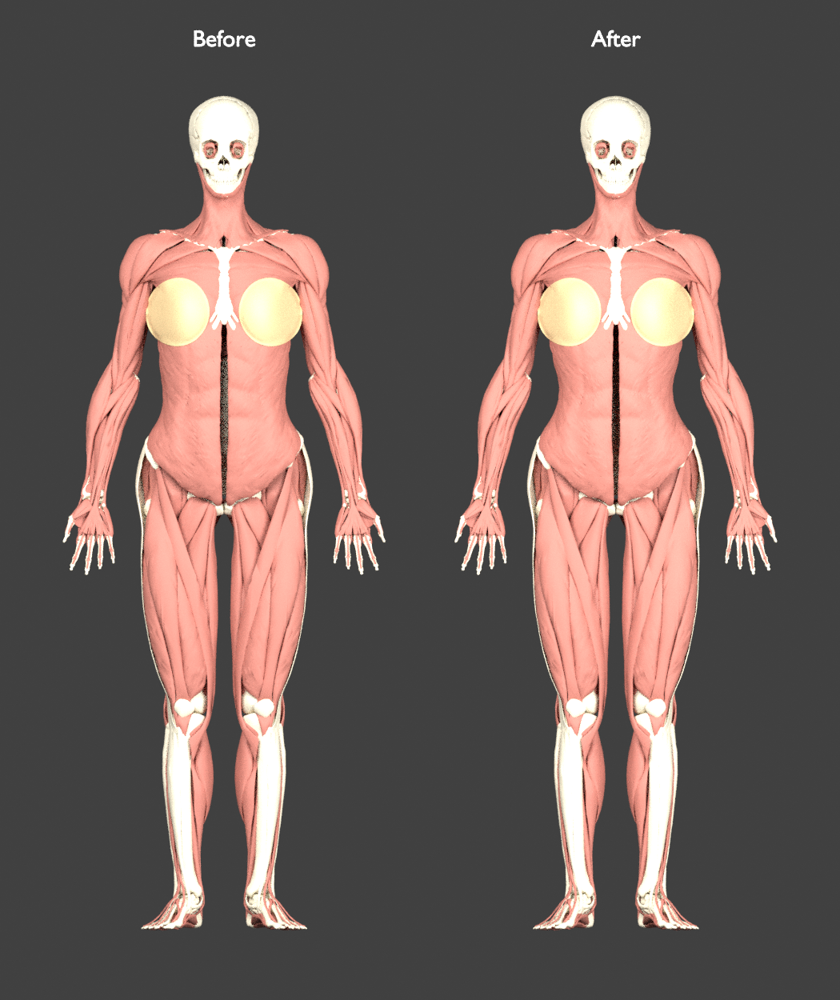
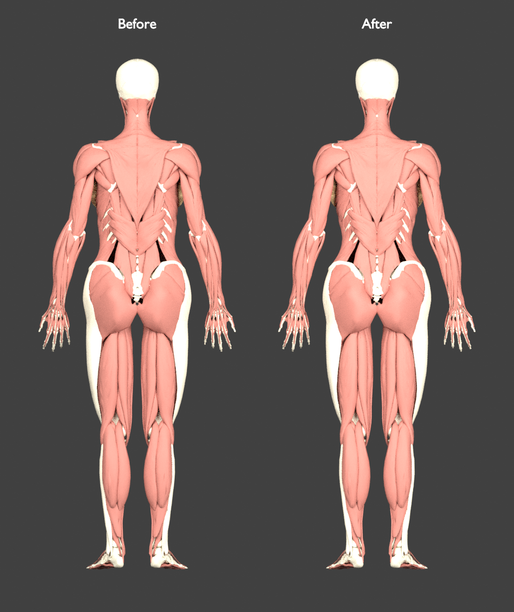
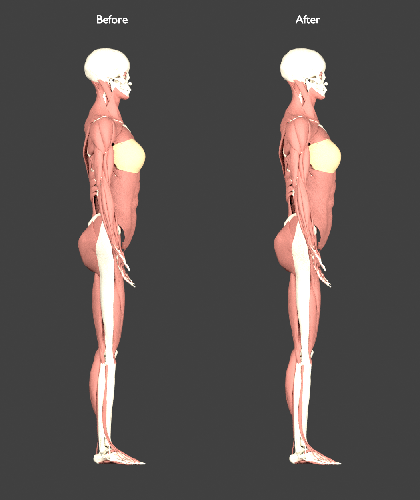

# Further waist refinement

Published after front, back and side review. Current manifest SHA-256: `9b6f0fc90c80e4cd50a7ec65fa9d43ddeb0d6e5d79b6d1b9a78105443610730b`.

The user requested a slimmer waist following the same [front, back and side reference](https://as2.ftcdn.net/v2/jpg/00/77/91/69/1000_F_77916955_HK9TuhgkxYxzm4SC3uvUbdCKZyRZ83FG.jpg). The goal is a more defined inward curve between the lower ribs and hips while retaining the recent shoulder/hip balance and rounded glute contour.

The first candidate lowered the existing waist knot directly. It narrowed the waist but also moved parts of the upper arms because the existing torso-to-arm blend extended too far laterally. It was rejected before publication. The revised field is restricted by height and lateral distance so it fades out before reaching the arms.

## Measured result

The [measured geometry and scope report](../data/anatomy/female-waist-slimmer-review.json) records the external-oblique waist-band envelope narrowing from **245.907 to 229.420 mm (6.705%)**. This is a mesh width, not a waist circumference or annotated anatomical measurement. Shoulder, hip, gluteal, scapular and upper-thigh envelope widths remain identical. Every mesh retains its vertical/depth coordinates and source topology.

The field retains the previous whole-body lateral knots and adds `waistRefinement`: delta −.095, source height ramp [1.03,1.12,1.21] m, and radial fade [.14,.17] m. It uses smooth transitions, reaches maximum narrowing near the middle of the height interval, and ends before the main arm geometry. Its effect applies across torso tissues; it also reshapes lower ribs and abdominal organs. It is not a surface-only sculpt, and correct organ shape or function has not been established.

All 68 screened upper-limb bone meshes retain bit-identical positions and normals. Among 72 named arm-muscle meshes, 70 have identical positions; only two vertices in each long triceps head move, by less than 0.001 mm. All eight checked glute muscle/vein meshes retain exact positions and normals, preserving the [recent glute correction](female-glute-contour-review.md).

## Matched views

These actual-mesh renders use the same camera, scale and lighting for both stages. They show muscles, bones and outer breast envelopes; other systems and application materials are omitted.







## Verification

Source validation passes for all 2,243 meshes, 4,246 concepts, 2,437,922 triangles and binary buffers. Thirteen morph tests and three integration tests pass, including compact height/radial support, boundary Jacobians, JavaScript/Python agreement and normal transformation. The minimum sampled Jacobian remains positive at 0.377125; finite sampling does not establish positivity everywhere or absence of intersections.

The first, rejected broad candidate is preserved in [its report](../data/anatomy/female-waist-slimmer-first-candidate.json). It achieved the same waist width but moved humerus vertices up to 11.3 mm and ulna vertices up to 7.3 mm. Global shoulder widths and bone spans alone failed to reveal this mid-shaft deformation, so final checks compare complete vertex arrays.

Current [pelvis](pelvis-surface-audit.md) and [breast](breast-containment-audit.md) audits record internal-fit screens. Existing registration and containment issues remain. These proportions are illustrative estimates, not a sourced female subject or a validated anatomical standard.

## Reproduce

```bash
python3 scripts/build-female-reconstruction.py --output-dir /tmp/human-atlas-waist-isolated-candidate/public/models
python3 scripts/female-proportion-morph.test.py
python3 scripts/female-morph-integration.test.py
python3 scripts/female-proportion-review.py --before-root /tmp/human-atlas-glute-rounded-final-candidate --after-root /tmp/human-atlas-waist-isolated-candidate --reference https://as2.ftcdn.net/v2/jpg/00/77/91/69/1000_F_77916955_HK9TuhgkxYxzm4SC3uvUbdCKZyRZ83FG.jpg --output data/anatomy/female-waist-slimmer-review.json
python3 scripts/female-waist-scope-review.py
```

Keep the saved pre-waist atlas as the before root and include original source manifests/buffers in the candidate facade for source validation.
